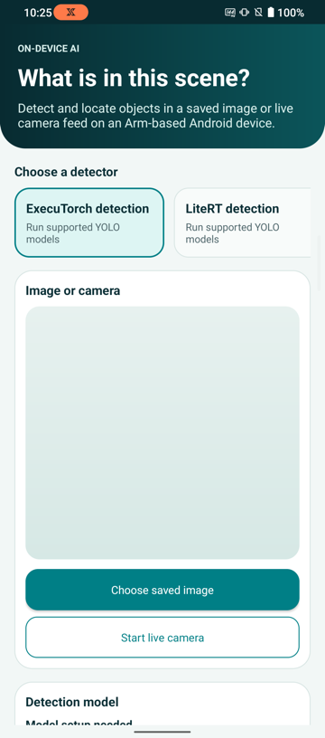

# Scene Detector Android application

This example application accompanies the [Arm Learning Path for running object-detection models from the Arm AI Portal on Android](https://learn.arm.com/learning-paths/mobile-graphics-and-gaming/ai-portal-mobile-object-detection). It is intended for learning how models run on devices and is not a reference production application.

This Android application runs Arm-optimized object-detection models locally on an Arm64 phone or emulator. It includes one supplied adapter:

- `ExecuTorchObjectDetectionAdapter` provides **ExecuTorch detection** for supported YOLO models. It routes each model to the matching preprocessing, output decoding, and postprocessing configuration.

The application imports model binaries at run time, so the model files are not stored in the Android application package (APK).

## Application views

<p align="center">
  
  
</p>

The application detects objects in saved images or frames from a live camera. It displays each retained label, confidence score, and bounding box.

## Requirements

- Android Studio with Android SDK 35
- Java 17, supplied by Android Studio
- An Arm64 Android device running Android 9, API 28, or later
- One supported or registered model file downloaded from the Arm AI Portal

## Supported models

The model registry uses the filename to select the supplied adapter and the detector configuration required by the model package. The adapter validates the model and routes it to the matching preprocessing and output-decoding strategy.

| Model | Runtime | Import this file |
| --- | --- | --- |
| [YOLOv5s INT8](https://huggingface.co/Arm/yolov5s-int8-xnnpack-executorch) | ExecuTorch | `yolov5s_raspberry_executorch_optimized.pte` |
| [YOLOv8s INT8](https://huggingface.co/Arm/yolov8s-int8-xnnpack-executorch) | ExecuTorch | `yolov8s_raspberry_executorch_optimized.pte` |
| [YOLOv9s INT8](https://huggingface.co/Arm/yolov9s-int8-xnnpack-executorch) | ExecuTorch | `yolov9s_raspberry_executorch_optimized.pte` |

`ExecuTorchYoloDetector` handles the three YOLO configurations.

## Download a model

Create a Python virtual environment and install the Hugging Face Hub package:

On macOS or Linux:

```bash
python3 -m venv .hf-venv
source .hf-venv/bin/activate
python -m pip install --upgrade huggingface_hub
```

On Windows PowerShell:

```powershell
py -m venv .hf-venv
.\.hf-venv\Scripts\Activate.ps1
python -m pip install --upgrade huggingface_hub
```

Set the repository ID for one of the supported models, then run the included download script. The `--print-path` option returns the downloaded file path for later commands:

On macOS or Linux:

```bash
MODEL_ID="Arm/yolov8s-int8-xnnpack-executorch"
MODEL_FILE="$(python download_model.py \
  --repo-id "$MODEL_ID" \
  --print-path)"

printf 'Model file: %s\n' "$MODEL_FILE"
```

On Windows PowerShell:

```powershell
$MODEL_ID = "Arm/yolov8s-int8-xnnpack-executorch"
$MODEL_FILE = python download_model.py `
  --repo-id "$MODEL_ID" `
  --print-path

Write-Output "Model file: $MODEL_FILE"
```

For a supported model, the script downloads the registered `.pte` file. For another repository, it downloads the package and selects its only `.pte` file. Use `--filename` if the repository contains more than one model file.

Copy the downloaded model to the Android **Downloads** directory through ADB:

```console
adb push "$MODEL_FILE" /sdcard/Download/
```

## Open and run the application

1. Clone or download this repository.
2. Open the repository root in Android Studio.
3. Wait for Gradle sync to finish.
4. Connect an Arm64 Android phone or start an Arm64 emulator.
5. Select the `app` configuration and run it.
6. Select **Add or change model** and choose the matching optimized `.pte` file.
7. Select **Choose saved image** and run **Detect objects**, or select **Start live camera**.

The application does not include a sample image. You can select an image already stored on the device or download this street scene from Wikimedia Commons.

On macOS or Linux:

```bash
curl --fail --location --output street-scene.jpg "https://upload.wikimedia.org/wikipedia/commons/thumb/7/71/DSC_6799-_a_man_riding_a_motorcycle_down_a_street_next_to_a_parked_car.jpg/1280px-DSC_6799-_a_man_riding_a_motorcycle_down_a_street_next_to_a_parked_car.jpg"
adb push street-scene.jpg /sdcard/Download/
```

On Windows PowerShell:

```powershell
curl.exe --fail --location --output street-scene.jpg "https://upload.wikimedia.org/wikipedia/commons/thumb/7/71/DSC_6799-_a_man_riding_a_motorcycle_down_a_street_next_to_a_parked_car.jpg/1280px-DSC_6799-_a_man_riding_a_motorcycle_down_a_street_next_to_a_parked_car.jpg"
adb push street-scene.jpg /sdcard/Download/
```

The sample image is by Jonas Kimmich, available from [Wikimedia Commons](https://commons.wikimedia.org/wiki/File:DSC_6799-_a_man_riding_a_motorcycle_down_a_street_next_to_a_parked_car.jpg), and licensed under [CC BY-SA 4.0](https://creativecommons.org/licenses/by-sa/4.0/).

The application stores the selected model in its private files directory. Clearing application data or uninstalling the application removes imported models.

## Register another compatible model

A model that matches an existing detector strategy's task, tensor shapes, preprocessing, labels, box format, and postprocessing can use the supplied adapter after you add one `ModelDescriptor` to `CompatibleModelRegistry.java`.

Each descriptor records the filename, adapter, detector configuration, and default confidence threshold together. For example, another detector that matches the supplied YOLOv8 strategy can be registered with:

```java
new ModelDescriptor(
        "my-yolov8-detector",
        "My YOLOv8 detector",
        ExecuTorchObjectDetectionAdapter.ID,
        "ExecuTorch",
        "my-yolov8-detector.pte",
        ExecuTorchObjectDetectionAdapter.CONFIG_YOLO_V8,
        75
)
```

Add the descriptor to the list returned by `CompatibleModelRegistry.models()`, rebuild the APK, and import the model using its unchanged filename. This route reuses an existing detector strategy. It is appropriate only when the model package matches that strategy's complete input, output, label, box-decoding, and postprocessing contract.

If the model keeps the ExecuTorch runtime and per-image detection interface but needs different preprocessing or output decoding, add another detector configuration and strategy. Create a separate adapter only when the runtime or callable methods change while the model still accepts one bitmap, uses the confidence control, and returns bounding boxes through `DetectionResult`.

## Extend the application

The application discovers detection modes through `AdapterRegistry.java`. The supplied adapter supports the registered ExecuTorch YOLO models. `GeneratedAdapterRegistry.java` is intentionally empty and provides a build-time extension point for a model package that does not fit that adapter.

A LiteRT object detector could implement the same `DetectionAdapter` interface and reuse the application's image input, camera input, confidence control, and overlay UI. A separate `LiteRtObjectDetectionAdapter` would provide the LiteRT dependency, `.tflite` validation, preprocessing, model runner, and output decoder. The supplied application does not include a tested LiteRT adapter.

Tracking, multi-frame input, different controls, or another result type needs changes to the shared interfaces and `MainActivity.java` before another adapter can support the workflow.

As an optional extra, the `adapter-generation/` directory contains scripts and a coding-agent prompt for inspecting a complete model package and preparing another per-image detection adapter. The prompt tells the coding agent to report when broader application-contract changes are needed. Generated Java code, resources, and runtime dependencies must be compiled into a new APK and tested on an Arm64 Android device.

## License

This project is provided under the [Arm Education End User License Agreement](LICENSE.md).
